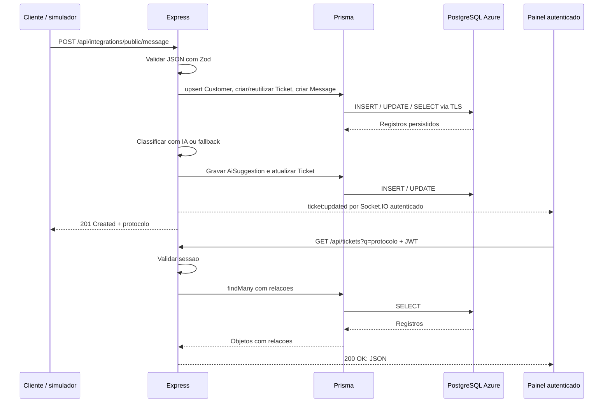
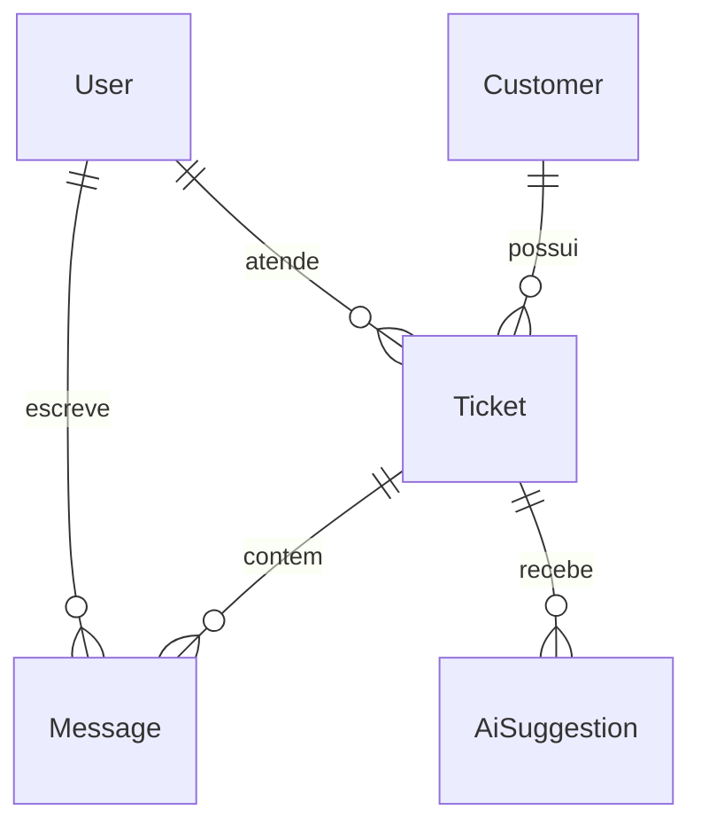

# Implementação técnica — HUB Claro

## Solução e tecnologias

O HUB Claro centraliza atendimento por site, aplicativo e WhatsApp. O cliente recebe um protocolo e o atendente acompanha histórico, prioridade, sugestões da IA e indicadores.

| Camada | Tecnologia | Responsabilidade e complexidade |
|---|---|---|
| Frontend | React 18, TypeScript, CSS | Componentes, sessão, filtros, conversa e atualização de estado |
| Build | Vite 6 e TypeScript | Tipagem, compilação e bundles estáticos |
| Backend | Node.js 24, Express 4 | API REST, regras de atendimento, integrações e tratamento de erros |
| Segurança | JWT, bcrypt e papéis | Sessão assinada, hash de senha e autorização |
| Validação | Zod | Validação de JSON, com HTTP 400 para entrada inválida |
| Persistência | Prisma 6, PostgreSQL 16 | Relações, índices, migrações SQL e consultas tipadas |
| Tempo real | Socket.IO | JWT na conexão e eventos ticket:updated |
| Hospedagem | Azure App Service Linux F1 | API e arquivos React no mesmo domínio HTTPS |
| Banco gerenciado | PostgreSQL Flexible Server B1ms | Banco clarohub e usuário clarohub_app exclusivos |
| Integrações | IA e WhatsApp Cloud API | Triagem, sugestões, webhooks e envio quando configurados |

Não há hardware dedicado da equipe: navegador e internet acessam computação e armazenamento fornecidos pelo Azure. SQLite continua disponível para desenvolvimento local.

## Arquitetura frontend e backend

```mermaid
flowchart TB
  subgraph Browser[Navegador]
    UI[React: login, fila, conversa, indicadores]
    HTTP[api.ts: fetch JSON e JWT]
    SOCKET[useHubSocket: Socket.IO autenticado]
    UI --> HTTP
    UI <--> SOCKET
  end
  subgraph Azure[Microsoft Azure]
    subgraph App[App Service Linux: HUB Claro]
      STATIC[Express static: web/dist]
      ROUTES[Rotas auth, tickets, integrations, health]
      MIDDLE[JWT, papeis, Zod e erros]
      SERVICE[Servicos de atendimento e triagem]
      ORM[Prisma Client]
      REALTIME[Servidor Socket.IO]
      ROUTES --> MIDDLE --> SERVICE --> ORM
      SERVICE --> REALTIME
    end
    DB[(PostgreSQL 16: banco clarohub)]
  end
  STATIC -->|HTTPS: HTML, CSS e JS| UI
  HTTP <-->|HTTPS: REST JSON| ROUTES
  SOCKET <-->|WSS: eventos| REALTIME
  ORM <-->|SQL sobre TLS: porta 5432| DB
  SERVICE <-->|HTTPS| AI[Provedor de IA / fallback local]
  META[WhatsApp Cloud API] <-->|HTTPS: webhook e envio| ROUTES
```



O navegador nunca recebe DATABASE_URL. Frontend e backend são camadas separadas no código e publicados no mesmo App Service. O servidor PostgreSQL e o plano Azure são compartilhados com o AvaliaTech; o banco e a aplicação do HUB Claro são separados.

## Fluxo técnico de gravação e leitura





IntegrationEvent registra eventos externos. Índices em status + channel, lastMessageAt, ticketId + createdAt e source + eventType apoiam fila, histórico e diagnóstico. Modelo e DDL: server/prisma/azure/schema.prisma e server/prisma/azure/migrations/.

## Requests e comprovação

[azure-demo.http](../requests/azure-demo.http) contém login, POST público, GET pelo protocolo, métricas, resposta do atendente e alteração de status.

Execute na raiz do repositório:

```powershell
./scripts/verify-cloud.ps1
```

O verificador confirma PostgreSQL conectado, HTTP 401 sem login, HTTP 400 para JSON inválido, login, bloqueio de WebSocket anônimo, criação, consulta do mesmo cliente/mensagem/sugestão, atribuição, resposta, encerramento, releitura, métricas e evento em tempo real. O provedor da triagem é identificado como openai ou local-fallback.

Cada execução concluída grava um JSON em docs/evidencias/ com URL, data, métodos, caminhos, status e respostas. Senhas, JWT e configurações das integrações não são incluídos. Os registros sintéticos permanecem no banco para consulta.

Resultados executados e limitações externas: [índice de evidências](evidencias/README.md).

## Publicação e limites

O deploy valida tipos, compila ambas as camadas e envia um ZIP por lista explícita de arquivos. O Azure instala dependências Linux. O startup gera Prisma PostgreSQL, aplica migrações, executa seed idempotente e inicia a API. Arquivos .env, SQLite e segredos não entram no ZIP.

F1 tem recursos limitados e pode apresentar inicialização lenta. O PostgreSQL utiliza os recursos/créditos existentes. Não foi comprovada criação automática de orçamento. A entrada ainda executa gravações sequenciais; transações, idempotência e filas são evoluções para maior escala. Publicar o webhook não registra automaticamente o callback no painel Meta.

## Referências oficiais

- [Deploy ZIP no App Service](https://learn.microsoft.com/azure/app-service/deploy-zip)
- [PostgreSQL: bancos via Azure CLI](https://learn.microsoft.com/cli/azure/postgres/flexible-server/db)

